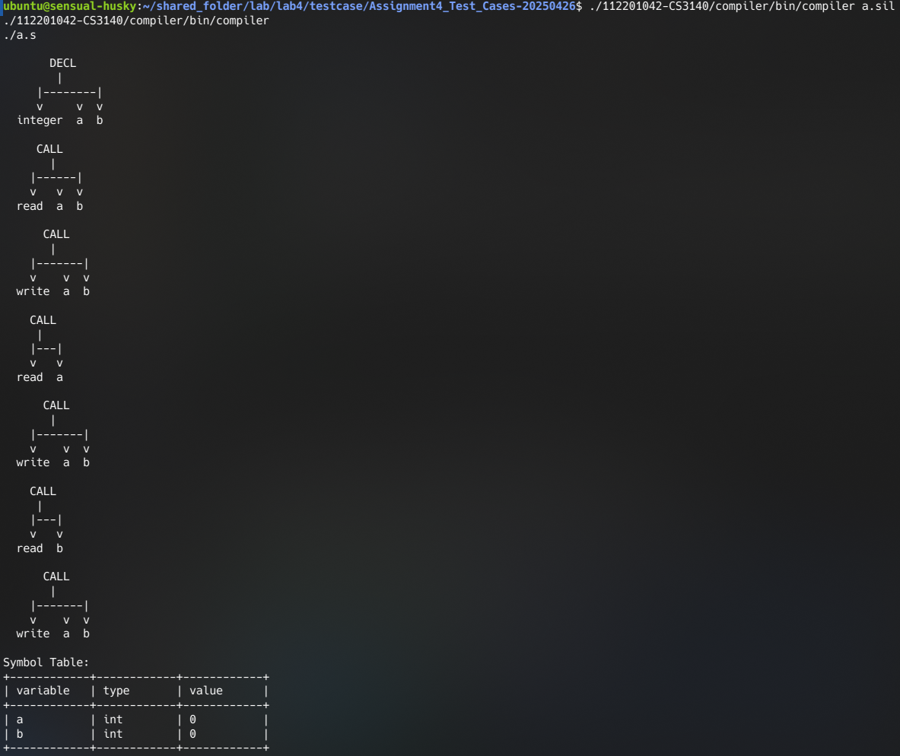
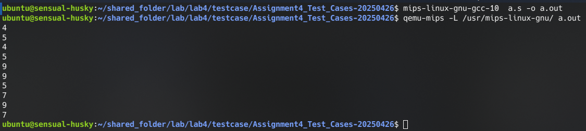

# 112201042 
# Anup Kumar

# building compiler
inside the directory of project:

$cd compiler

$make clean

$make

now we have executable(compiler) in bin folder.

# running compiler

invoke the built compiler in any directory with path of sil file in that directory, compiler will produce assembly (.s) file of same name as name of input sil file in same directory.

:- path_to_compiler path_to_sil_file  ---> sil_filname.s (in invoked directory)

example:
ubuntu@sensual-husky:~/shared_folder/lab/lab4/testcase/Assignment4_Test_Cases-20250426$ ./112201042-CS3140/compiler/bin/compiler a.sil

this will produce a.s file in same directory

# ast and symboltable

# a.out output 

--assignment four is done completely it passed the all given test case

--compiler is generating in 112201042-CS3140/compiler/bin folder with name compiler

--assembly file (.s) is generated in directory where compiler is called or invoked.

